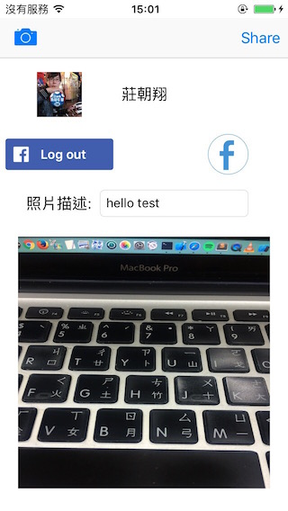

# FacebookTest

Feature
------------
1. Custom login button and Default login button.
2. Fetch user name and picture.
3. Take a picture and share to Facebook with script without default dialog.

Screenshot
------------

Reference
------------
[Facebook Graph API](https://developers.facebook.com/docs/graph-api)
